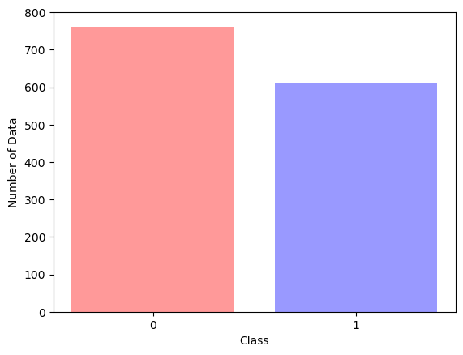
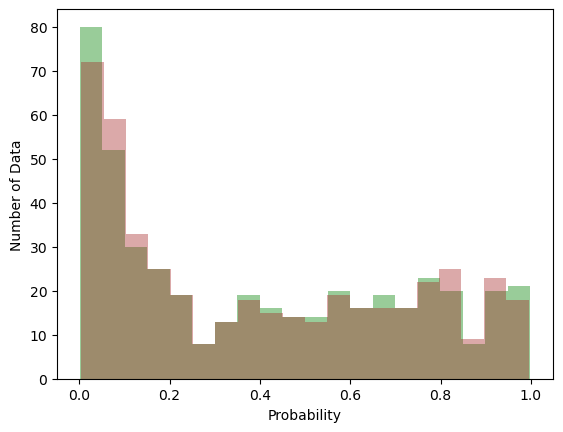



```python
import pandas as pd
import numpy as np
import matplotlib.pyplot as plt
import statsmodels.api as sm
from sklearn.model_selection import train_test_split
```

# Probit and Logit Regression

**The building block of artificial intelligence**

*Posted on: September 2023*

The fundamental building block of neural network is a model that mimic neuron cell. We can model this neuron using a model that output a value between 0 and 1, zero representing inactive cell and 1 representing active cell. Two populars model that output a value between 0 and 1 are probit regression and logit regression.

Probit and logit regression are family of regression model that model a process that output a value between 0 and 1. Usually, the process is the probability of an event happening.

Both are similar in term of how they model the output, which is using the cumulative distribution function (cdf) of a model. The differecne is that while the probit regression uses the cdf of normal distribution, the logit regression uses the cdf of logistic distribution.

An example of a process that can be modelled with probit regression and logit regression is the banknote data from [UC Irvine Machine Learning Repository](https://archive.ics.uci.edu/dataset/267/banknote+authentication). This data contains the wavelet result of images.


```python
data_path = "https://archive.ics.uci.edu/static/public/267/banknote+authentication.zip"

df = pd.read_csv(data_path, header=None)
df.head()
```


<div>
<style scoped>
    .dataframe tbody tr th:only-of-type {
        vertical-align: middle;
    }

    .dataframe tbody tr th {
        vertical-align: top;
    }

    .dataframe thead th {
        text-align: right;
    }
</style>
<table border="1" class="dataframe">
  <thead>
    <tr style="text-align: right;">
      <th></th>
      <th>0</th>
      <th>1</th>
      <th>2</th>
      <th>3</th>
      <th>4</th>
    </tr>
  </thead>
  <tbody>
    <tr>
      <th>0</th>
      <td>3.62160</td>
      <td>8.6661</td>
      <td>-2.8073</td>
      <td>-0.44699</td>
      <td>0</td>
    </tr>
    <tr>
      <th>1</th>
      <td>4.54590</td>
      <td>8.1674</td>
      <td>-2.4586</td>
      <td>-1.46210</td>
      <td>0</td>
    </tr>
    <tr>
      <th>2</th>
      <td>3.86600</td>
      <td>-2.6383</td>
      <td>1.9242</td>
      <td>0.10645</td>
      <td>0</td>
    </tr>
    <tr>
      <th>3</th>
      <td>3.45660</td>
      <td>9.5228</td>
      <td>-4.0112</td>
      <td>-3.59440</td>
      <td>0</td>
    </tr>
    <tr>
      <th>4</th>
      <td>0.32924</td>
      <td>-4.4552</td>
      <td>4.5718</td>
      <td>-0.98880</td>
      <td>0</td>
    </tr>
  </tbody>
</table>
</div>


```python
plt.bar(x=df[4].value_counts().keys(), height=df[4].value_counts().values, color=["red", "blue"], alpha=0.4)
plt.xticks([0, 1])
plt.xlabel("Class")
plt.ylabel("Number of Data")
```


    Text(0, 0.5, 'Number of Data')


    

    


```python
X_train, X_test, y_train, y_test = train_test_split(df[[1, 2, 3]], df[4], test_size=0.33, random_state=0)
```

## Probit Regression

The probit model can be written mathematically as:

$$Y = \phi(g(x))$$

where $g(x)$ is a linear model

$$g(x) = \theta_0 + \theta_1 X_1 + \theta_2 X_2 + ... + \theta_n X_n$$

Probit regression is a CDF of normal distribution.


```python
probit_model = sm.Probit(y_train, X_train)
probit_res = probit_model.fit()
print(probit_res.summary())
```

    Optimization terminated successfully.
             Current function value: 0.434708
             Iterations 6
                              Probit Regression Results                           
    ==============================================================================
    Dep. Variable:                      4   No. Observations:                  919
    Model:                         Probit   Df Residuals:                      916
    Method:                           MLE   Df Model:                            2
    Date:                Sun, 24 Sep 2023   Pseudo R-squ.:                  0.3675
    Time:                        12:42:13   Log-Likelihood:                -399.50
    converged:                       True   LL-Null:                       -631.66
    Covariance Type:            nonrobust   LLR p-value:                1.489e-101
    ==============================================================================
                     coef    std err          z      P>|z|      [0.025      0.975]
    ------------------------------------------------------------------------------
    1             -0.3449      0.021    -16.506      0.000      -0.386      -0.304
    2             -0.2212      0.020    -11.272      0.000      -0.260      -0.183
    3             -0.4629      0.036    -13.040      0.000      -0.533      -0.393
    ==============================================================================
    

### Logit Regression

Logistic regression can be expressed mathematically as

$$Y = \frac{1}{1+e^{-(g(x))}}$$

with $g(x)$ as a linear model

$$g(x) = \theta_0 + \theta_1 X_1 + \theta_2 X_2 + ... + \theta_n X_n$$

Logit regression is almost the same as probit regression, except that logit regression uses logistic model instead of normal distribution. The CDF of logistic model is called the logistic function and is given above.


```python
logit_model = sm.Logit(y_train, X_train)
logit_res = logit_model.fit()
print(logit_res.summary())
```

    Optimization terminated successfully.
             Current function value: 0.437725
             Iterations 7
                               Logit Regression Results                           
    ==============================================================================
    Dep. Variable:                      4   No. Observations:                  919
    Model:                          Logit   Df Residuals:                      916
    Method:                           MLE   Df Model:                            2
    Date:                Sun, 24 Sep 2023   Pseudo R-squ.:                  0.3632
    Time:                        12:42:13   Log-Likelihood:                -402.27
    converged:                       True   LL-Null:                       -631.66
    Covariance Type:            nonrobust   LLR p-value:                2.382e-100
    ==============================================================================
                     coef    std err          z      P>|z|      [0.025      0.975]
    ------------------------------------------------------------------------------
    1             -0.5808      0.038    -15.100      0.000      -0.656      -0.505
    2             -0.3699      0.035    -10.648      0.000      -0.438      -0.302
    3             -0.7805      0.063    -12.299      0.000      -0.905      -0.656
    ==============================================================================
    

## Comparing Both Model

Many documentation state that probit and logit model result do not differ much from each other. However because of the interpretability of the logit model, this model is used more often in binary regression.


```python
probit_pred = probit_model.predict(probit_res.params, X_test)
logit_pred = logit_model.predict(logit_res.params, X_test)
```


```python
n_bins = 20
fig, ax = plt.subplots(1, 1)

ax.hist(probit_pred, bins=n_bins, color="green", alpha=0.4)
ax.hist(logit_pred, bins=n_bins, color="brown", alpha=0.4)
plt.xlabel("Probability")
plt.ylabel("Number of Data")
```


    Text(0, 0.5, 'Number of Data')


    

    


## Intepreting Coefficient of Probit Regression and Logit Regression

Intepreting probit coefficient is more difficult than intepreting logit coefficient. This is because the marginal effect of an independent variable in probit regression is a function of other independent variables.

In contrast, we can interpret logit regression directly to odds. For example from above, the logit coefficient that correspond to independent variable number 1 is -0.5808. Using $\frac{1}{1+e^{-(\theta_0 + \theta_1 X)}}$, we got the log odds of 0.358. This means, if all independent variable coefficients except independent variable number 1 coefficient is zero, an increase in it independent variable 1 will increase the odds of the dependent variable resulting in 1 to 0 of about 0.358. In other words, it reduces the dependent variable.
